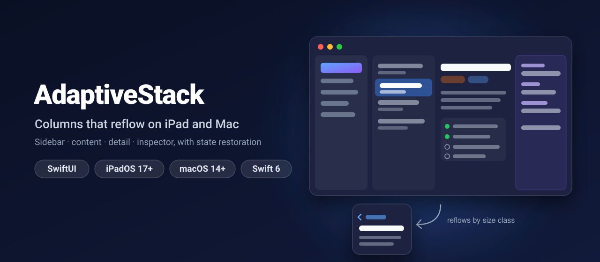
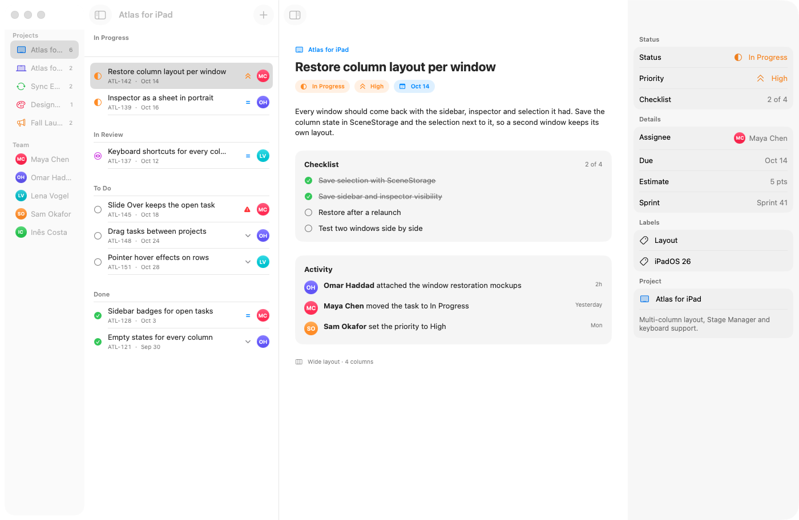
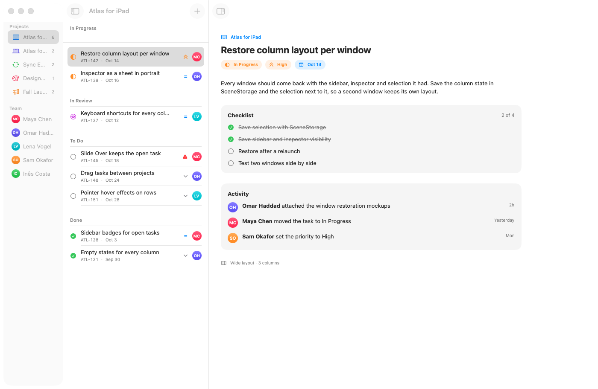
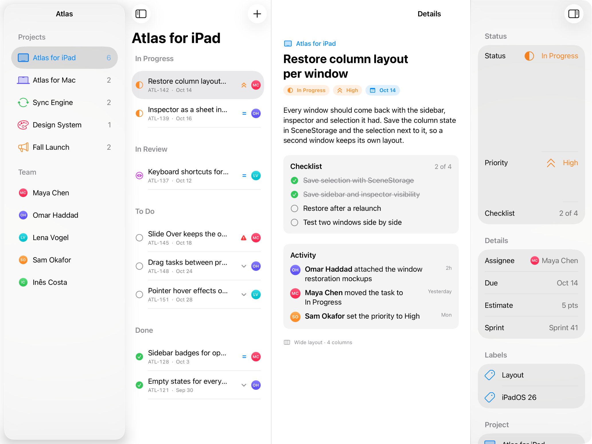
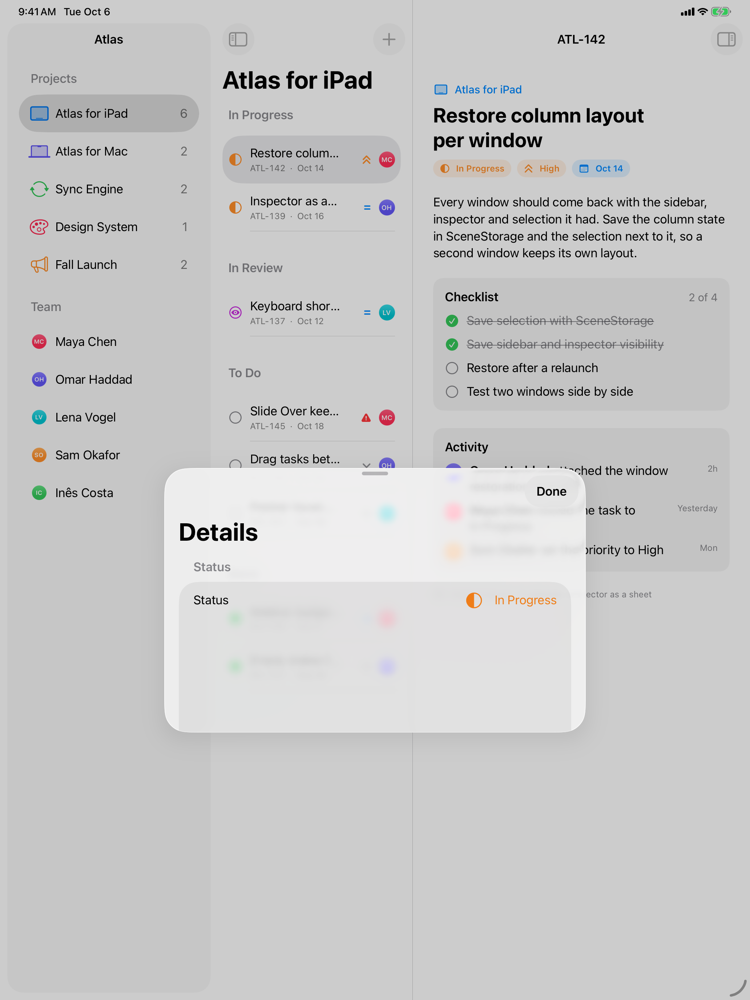

<p align="center">
  
</p>

<p align="center">
  <a href="https://github.com/halilozel1903/AdaptiveStack/actions/workflows/ci.yml"></a>
  
  
  
  
  <a href="LICENSE"></a>
</p>

**AdaptiveStack** gives your SwiftUI app the four-column layout of Mail, Notes and Xcode on iPad and Mac: **sidebar, content, detail and inspector** that **reflow with the available width**. All four sit side by side on a wide screen. On a medium one the sidebar collapses and the inspector becomes a sheet (iPad) or takes the sidebar's room (Mac). In Slide Over or a narrow window everything turns into one **navigation stack that keeps the same selection**. Selection and column visibility are `Codable`, so every window comes back the way the user left it.

```swift
@SceneStorage("selection") private var selection = AdaptiveSelection<Project.ID, Task.ID>()
@SceneStorage("columns") private var columns = AdaptiveColumnState()

AdaptiveStack(selection: $selection, columns: $columns) {
    ProjectList(selection: $selection.sidebar)
} content: {
    TaskList(project: selection.sidebar, selection: $selection.item)
} detail: {
    TaskDetail(task: selection.item)
} inspector: {
    TaskInspector(task: selection.item)
}
```

## Screenshots

Captured by CI from *Atlas*, the example project tracker, on macOS 26 and on an iPad Pro 13-inch simulator with iPadOS 26.

| Mac: every column | Mac: inspector hidden |
| :---: | :---: |
|  |  |

| iPad in landscape: every column | iPad in portrait: collapsed |
| :---: | :---: |
|  |  |

The iPad simulator is never rotated, since rotation from the command line is unreliable. It stays in its default portrait orientation. `ipad-collapsed.png` is that real portrait layout. For `ipad-full.png` the app lays itself out at the 13-inch landscape size (1376 × 1032 points, same size classes) scaled to the screen width, and the script crops the 4:3 band.

## Features

- **One view, four columns**: `AdaptiveStack { sidebar } content: { } detail: { } inspector: { }` builds a `NavigationSplitView` with SwiftUI's `.inspector`, column widths from the policy and the `.balanced` style.
- **A tested layout policy**: `AdaptiveLayoutPolicy` is a plain value with no SwiftUI in it. It takes the container width, the size classes, the platform and the user's choices, and returns which columns show, how the inspector is presented and what a collapsed stack shows. You can unit test every breakpoint.
- **Three modes**:
  - **Wide** (13-inch iPad in landscape, large Mac windows): sidebar, content, detail and inspector side by side.
  - **Medium** (iPad in portrait or split screen, smaller windows): an automatic sidebar collapses when it does not fit, and the inspector becomes a sheet on iPad or hides the sidebar to stay a column on the Mac.
  - **Compact** (Slide Over, narrow split screen, iPhone, narrow windows): a `NavigationStack` with the sidebar at its root, built from the same selection, so the user stays on the same task when the window shrinks or grows.
- **Selection that survives everything**: `AdaptiveSelection` holds the sidebar row and the item. Changing the project clears the task, and going back in the stack clears what was popped. It is `Codable` and `RawRepresentable`, so `@SceneStorage` and `@AppStorage` can store it directly.
- **Column visibility persistence**: `AdaptiveColumnState` stores the sidebar choice (`automatic`, `all`, `doubleColumn`, `detailOnly`) and whether the inspector is open. It works with `@SceneStorage` for each window or `@AppStorage` for the whole app, and decodes leniently so state saved by an older version still restores.
- **Toolbar buttons and keyboard shortcuts**: a sidebar button (⌥⌘S) in the content column and an inspector button (⌥⌘I) in the detail column. The shortcuts work on the Mac and with a hardware keyboard on iPad.
- **`.adaptiveInspector`**: the same column-or-sheet presentation for any view, with a Done button on the sheet.
- **`AdaptiveLayoutReader`** and `@Environment(\.adaptiveLayout)`: let any child read the current layout, for example to show a compact row in a narrow content column.
- **Swift 6 strict concurrency**, no dependencies, tested with Swift Testing.

## Installation

In Xcode choose **File › Add Package Dependencies…** and enter:

```
https://github.com/halilozel1903/AdaptiveStack
```

Or add it to `Package.swift`:

```swift
dependencies: [
    .package(url: "https://github.com/halilozel1903/AdaptiveStack", from: "1.0.0")
]
```

## Usage

### The stack

```swift
import AdaptiveStack
import SwiftUI

struct AtlasWindow: View {
    @SceneStorage("atlas.selection") private var selection = AdaptiveSelection<Project.ID, Task.ID>()
    @SceneStorage("atlas.columns") private var columns = AdaptiveColumnState(isInspectorPresented: true)

    var body: some View {
        AdaptiveStack(selection: $selection, columns: $columns) {
            List(projects, selection: $selection.sidebar) { project in
                Label(project.name, systemImage: project.symbol)
            }
            .navigationTitle("Atlas")
        } content: {
            List(tasks(in: selection.sidebar), selection: $selection.item) { task in
                TaskRow(task: task)
            }
        } detail: {
            TaskDetail(task: task(selection.item))
        } inspector: {
            TaskInspector(task: task(selection.item))
        }
    }
}
```

Use `List(selection:)` bound to `$selection.sidebar` and `$selection.item`. The split view highlights the selection, and in a compact layout selecting a row pushes the next column.

Leave out `columns:` to let the stack keep its own state, and leave out `inspector:` for a three-column layout without an inspector button.

### The layout policy

```swift
let policy = AdaptiveLayoutPolicy()                        // the defaults below
let layout = policy.layout(
    in: AdaptiveLayoutContext(width: 1032, horizontalSizeClass: .regular, platform: .iOS),
    columns: AdaptiveColumnState(isInspectorPresented: true)
)
layout.mode               // .medium
layout.visibleColumns     // [.content, .detail]
layout.columnVisibility   // .doubleColumn
layout.inspectorStyle     // .sheet
```

| Column | Minimum | Ideal | Maximum |
| --- | ---: | ---: | ---: |
| Sidebar | 200 | 260 | 340 |
| Content | 240 | 340 | 440 |
| Detail | 440 | 600 | – |
| Inspector | 240 | 300 | 380 |

| Width (points) | Mode | Columns | Inspector |
| --- | --- | --- | --- |
| 1376 (13" iPad landscape), 1400 (Mac) | Wide | Sidebar, content, detail, inspector | Column |
| 1180 (11" iPad landscape) | Medium | Sidebar, content, detail | Sheet on iPad; on the Mac the sidebar collapses and the inspector stays a column |
| 1032 (13" iPad portrait) | Medium | Content, detail | Sheet on iPad, column on the Mac |
| below 680, or a compact size class | Compact | One column in a navigation stack | Sheet |

The layout is **wide** from `wideWidthThreshold` (every ideal width plus the detail's minimum, 1340 points) and **compact** below `compactWidthThreshold` (content plus detail minimums, 680 points). A compact horizontal size class is always compact, and so is a compact vertical size class on iOS (an iPhone in landscape). Change the widths or the fallback to suit your content:

```swift
let policy = AdaptiveLayoutPolicy(
    sidebarWidth: AdaptiveColumnWidth(minimum: 180, ideal: 220, maximum: 300),
    detailWidth: AdaptiveColumnWidth(minimum: 360, ideal: 520, maximum: 1200),
    inspectorFallback: .sheet                               // .automatic, .sheet or .collapseSidebar
)

AdaptiveStack(selection: $selection, columns: $columns, policy: policy) { … }
```

### Selection and the compact stack

```swift
var selection = AdaptiveSelection<String, Int>(sidebar: "atlas", item: 142)
selection.compactPath      // [.content, .detail]: the stack shows the task
selection.compactColumn    // .detail

selection.sidebar = "website"  // another project: the task is cleared
selection.compactPath      // [.content]

selection.applyCompactPath([])   // the user went back to the projects
selection.isEmpty          // true
```

### Column visibility

```swift
columns.toggleSidebar(in: layout)   // hides a visible sidebar, shows a hidden one; ⌥⌘S does this
columns.toggleInspector()           // ⌥⌘I
columns.setSidebarVisible(false)
columns.resetSidebar()              // back to .automatic: the policy decides again

// Outside SwiftUI's property wrappers:
columns.save(to: .standard, forKey: "columns")
let restored = AdaptiveColumnState.restored(from: .standard, forKey: "columns")
```

`AdaptiveColumnVisibility` maps to and from `NavigationSplitViewVisibility` with `splitViewVisibility` and `init(_:)`.

### Reading the layout

```swift
struct TaskRow: View {
    @Environment(\.adaptiveLayout) private var layout

    var body: some View {
        if layout?.isCollapsed == true {
            CompactTaskRow(task: task)
        } else {
            WideTaskRow(task: task)
        }
    }
}

AdaptiveLayoutReader(columns: columns) { layout in
    Text("\(layout.mode.rawValue): \(layout.visibleColumns.count) columns")
}
```

### Inspector on any view

```swift
TaskDetail(task: task)
    .adaptiveInspector(isPresented: $showsInspector) {
        TaskInspector(task: task)
    }

// Or with a fixed style:
    .adaptiveInspector(isPresented: $showsInspector, style: .sheet) { … }
```

## How it works

| | Wide | Medium | Compact |
| --- | --- | --- | --- |
| Container | `NavigationSplitView` | `NavigationSplitView` | `NavigationStack(path:)` |
| Sidebar | Column | Column when it fits or the user asked for it | Root of the stack |
| Inspector | `.inspector` column | iPad: `.sheet`. Mac: `.inspector` column, sidebar collapsed | `.sheet` |
| Selection | `List(selection:)` | `List(selection:)` | Path derived from the selection |

`AdaptiveStack` measures its width with `AdaptiveLayoutReader`, reads the size classes on iPad and asks the policy for a layout. The split view's visibility binding is the policy's resolved value. When the user drags a column away, that change becomes an explicit choice in `AdaptiveColumnState`, and an automatic sidebar stays automatic until then. The inspector modifier applies both `.inspector` and `.sheet`, each gated by the resolved style, so switching between them never changes the view's identity.

## Example app

The `Example` folder contains *Atlas*, a made-up project tracker for iPad and Mac with projects, tasks grouped by status, a task detail with a checklist and activity, and an inspector with the task's metadata. Rotate the iPad, use split screen or Slide Over, or resize the Mac window to watch the columns reflow. Selection and columns are restored per window with `@SceneStorage`. The example uses [XcodeGen](https://github.com/yonaskolb/XcodeGen), so no project file has to live in the repo:

```bash
brew install xcodegen
cd Example && xcodegen generate
open AdaptiveStackDemo.xcodeproj    # schemes AdaptiveStackDemoPad and AdaptiveStackDemoMac
```

Launch with `-screenshot full`, `-screenshot collapsed` (iPad) or `-screenshot inspector-hidden` (Mac) to see the fixed scenes CI captures.

## Requirements

- Xcode 26 or later (Swift 6.2 toolchain)
- iPadOS 17+ (also runs on iOS 17+ as a navigation stack), macOS 14+

## Contributing

Issues and pull requests are welcome. Please run `swift test` before opening a PR.

## License

AdaptiveStack is available under the MIT license. See [LICENSE](LICENSE).
